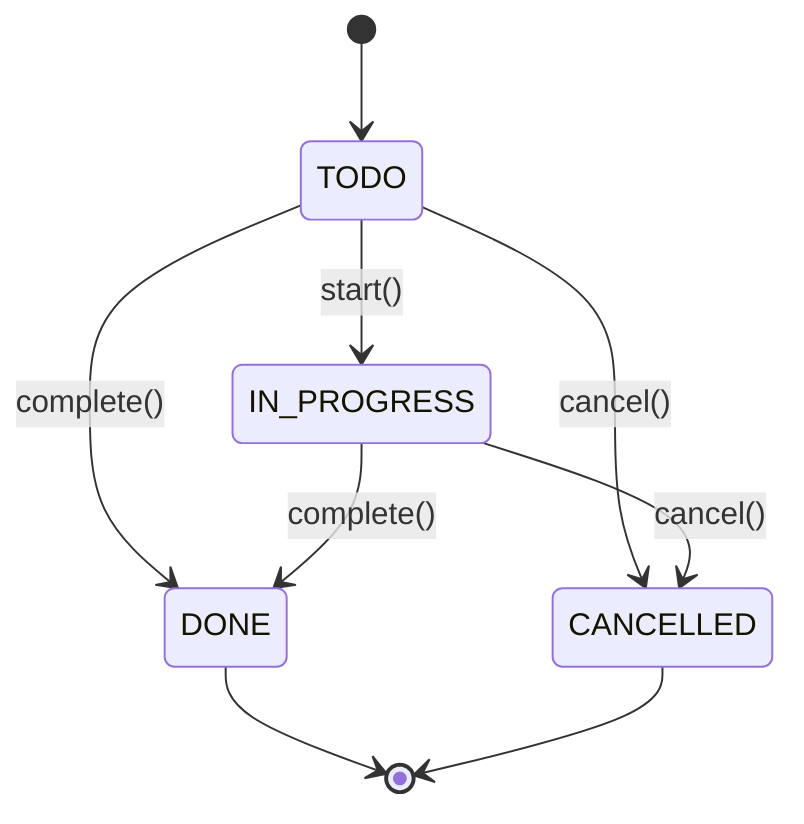

# Locked Decisions for Story 7fbd975e-048f-4fad-a0e7-02749d6a0909

## Implementation Approach
## Implementation Approach — Task Lifecycle State Transitions

### Overview
Refactor the existing `Task`, `TaskService`, `TaskStore`, and CLI (`main.cpp`) to enforce the full task lifecycle state machine with descriptive feedback via a `TransitionResult` enum. The existing code already has `startTask/completeTask/cancelTask` methods, but they lack proper state validation and error reporting.

### Key Design Decision: `TransitionResult` Enum
A new `enum class TransitionResult` is added to `task_status.h` (alongside `TaskStatus`):

```cpp
enum class TransitionResult {
    Success,          // Transition applied
    NotFound,         // Task ID does not exist
    InvalidTransition // Transition not allowed from current state
};
```

This replaces the current `bool` return values and provides structured, specific feedback to the CLI layer.

### State Machine Rules
The valid transitions enforce the full lifecycle:



Rejected transitions:
- **DONE → any**: "Completed tasks cannot be modified" (AC #4)
- **CANCELLED → any**: "Cancelled tasks cannot be modified" (AC #5)
- **IN_PROGRESS → IN_PROGRESS** (start): "Task must be in TODO to start" (AC #6)

### Layer-by-Layer Changes

#### 1. `task_status.h` — Add `TransitionResult`
- Add `enum class TransitionResult { Success, NotFound, InvalidTransition }` to the existing header
- Optionally add `inline std::string transition_result_to_string(TransitionResult)` for debug/logging

#### 2. `task.h / task.cpp` — Full State Machine in Task Methods
Refactor the three transition methods to return `TransitionResult` instead of `void`:

| Method | Current Behavior | New Behavior |
|---|---|---|
| `start_progress()` | Throws `std::logic_error` if not TODO | Returns `InvalidTransition` if not TODO; returns `Success` and sets IN_PROGRESS otherwise |
| `complete()` | Unconditionally sets DONE (no validation!) | Returns `InvalidTransition` if DONE or CANCELLED; returns `Success` and sets DONE otherwise |
| `cancel()` | Unconditionally sets CANCELLED (no validation!) | Returns `InvalidTransition` if DONE or CANCELLED; returns `Success` and sets CANCELLED otherwise |

No more exceptions thrown from these methods — pure return values.

#### 3. `task_store.h / task_store.cpp` — Propagate `TransitionResult`
The `update()` method currently takes a `std::function<void(Task&)>` mutator and returns `bool`.

Change: Create a new overload or modify the mutator signature for transition operations:
```cpp
TransitionResult update_status(int id, std::function<TransitionResult(Task&)> transition);
```
- Returns `TransitionResult::NotFound` if the ID doesn't exist
- Otherwise calls the transition lambda and returns its result
- The existing `update()` with `void` mutator remains for non-transition operations (assignTask, updatePriority)

#### 4. `task_service.h / task_service.cpp` — Return `TransitionResult`
Change signatures:
```cpp
// Before (current)
bool startTask(int id);
bool completeTask(int id);
bool cancelTask(int id);

// After
TransitionResult startTask(int id);
TransitionResult completeTask(int id);
TransitionResult cancelTask(int id);
```

Each method calls `store_.update_status(id, [](Task& t) { return t.start_progress(); })` etc.

#### 5. `main.cpp` — Specific Error Messages per AC
The CLI handlers switch on the `TransitionResult` to provide AC-specific messages:

```cpp
static void startTask(TaskService& service) {
    int id = readId("Task ID to start: ");
    if (id < 0) return;
    auto result = service.startTask(id);
    switch (result) {
        case TransitionResult::Success:
            std::cout << "Task " << id << " is now IN_PROGRESS." << std::endl;
            break;
        case TransitionResult::NotFound:
            std::cout << "Task not found." << std::endl;
            break;
        case TransitionResult::InvalidTransition:
            std::cout << "Cannot start task — task must be in TODO status." << std::endl;
            break;
    }
}
```

Similar patterns for `completeTask` and `cancelTask`, with messages tailored to each AC:
- Complete on DONE/CANCELLED: "Cannot complete task — completed/cancelled tasks cannot be modified."
- Cancel on DONE/CANCELLED: "Cannot cancel task — completed/cancelled tasks cannot be modified."
- Start on IN_PROGRESS: "Cannot start task — task must be in TODO status."

### Files Modified (no new files)
| File | Change |
|---|---|
| `src/task_status.h` | Add `TransitionResult` enum |
| `src/task.h` | Change return types of `start_progress()`, `complete()`, `cancel()` from `void` to `TransitionResult` |
| `src/task.cpp` | Implement state validation in all three methods, remove exception throws |
| `src/task_store.h` | Add `update_status()` method returning `TransitionResult` |
| `src/task_store.cpp` | Implement `update_status()` |
| `src/task_service.h` | Change `startTask/completeTask/cancelTask` return type from `bool` to `TransitionResult` |
| `src/task_service.cpp` | Use `update_status()` and return `TransitionResult` |
| `src/main.cpp` | Update CLI handlers to switch on `TransitionResult` with specific messages |
| `tests/task_service_test.cpp` | Add lifecycle transition tests (see Validation decision) |

## Validation
## Validation & Testing — Lifecycle State Transitions

### State Transition Validation Rules

All validation is enforced **inside the `Task` methods** (`start_progress()`, `complete()`, `cancel()`), with `TransitionResult` propagated through `TaskStore` and `TaskService` to the CLI.

#### Allowed Transitions Matrix

| Current State | `start_progress()` | `complete()` | `cancel()` |
|---|---|---|---|
| **TODO** | ✅ → IN_PROGRESS | ✅ → DONE | ✅ → CANCELLED |
| **IN_PROGRESS** | ❌ InvalidTransition | ✅ → DONE | ✅ → CANCELLED |
| **DONE** | ❌ InvalidTransition | ❌ InvalidTransition | ❌ InvalidTransition |
| **CANCELLED** | ❌ InvalidTransition | ❌ InvalidTransition | ❌ InvalidTransition |

#### Validation Logic per Method

**`Task::start_progress()`**
- Guard: `if (status_ != TaskStatus::TODO) return TransitionResult::InvalidTransition;`
- Rejects: IN_PROGRESS (AC #6), DONE (AC #4), CANCELLED (AC #5)

**`Task::complete()`**
- Guard: `if (is_terminal(status_)) return TransitionResult::InvalidTransition;`
- Allows: TODO → DONE, IN_PROGRESS → DONE (AC #2)
- Rejects: DONE (AC #4), CANCELLED (AC #5)

**`Task::cancel()`**
- Guard: `if (is_terminal(status_)) return TransitionResult::InvalidTransition;`
- Allows: TODO → CANCELLED, IN_PROGRESS → CANCELLED (AC #3)
- Rejects: DONE (AC #4), CANCELLED (AC #5)

#### Not-Found Handling (AC #7)
- `TaskStore::update_status()` returns `TransitionResult::NotFound` when the task ID doesn't exist in the map
- This is checked before the transition lambda is ever called

#### CLI Error Messages
Each `TransitionResult` maps to a specific user-facing message:

| Scenario | CLI Message |
|---|---|
| Start success | "Task {id} is now IN_PROGRESS." |
| Complete success | "Task {id} completed." |
| Cancel success | "Task {id} cancelled." |
| Start — invalid transition | "Cannot start task — task must be in TODO status." |
| Complete — invalid transition | "Cannot complete task — task is already completed or cancelled." |
| Cancel — invalid transition | "Cannot cancel task — task is already completed or cancelled." |
| Any — not found | "Task not found." |

### Tests — Ported + New

#### Ported from Java (3 tests already exist in Java, not yet in C++)
These Java tests cover lifecycle transitions and need to be added to `task_service_test.cpp`:

| Java Test | C++ Test Name | What It Tests |
|---|---|---|
| `TaskServiceTest.startTask_changesStatusToInProgress` | `startTask changes status to IN_PROGRESS` | AC #1: TODO → IN_PROGRESS |
| `TaskServiceTest.completeTask_fromInProgress` | `completeTask from IN_PROGRESS changes status to DONE` | AC #2: IN_PROGRESS → DONE |
| `TaskServiceTest.cancelTask_fromTodo` | `cancelTask from TODO changes status to CANCELLED` | AC #3: TODO → CANCELLED |
| `TaskServiceTest.startTask_failsForMissingId` | `startTask returns NotFound for missing ID` | AC #7: non-existent ID |

#### New Tests Required by Acceptance Criteria
These transitions are **not tested in the Java source** but are required by the story's ACs:

| C++ Test Name | AC | What It Tests |
|---|---|---|
| `completeTask from TODO changes status to DONE` | AC #2 | Direct TODO → DONE |
| `cancelTask from IN_PROGRESS changes status to CANCELLED` | AC #3 | IN_PROGRESS → CANCELLED |
| `startTask on DONE task returns InvalidTransition` | AC #4 | DONE is terminal |
| `completeTask on DONE task returns InvalidTransition` | AC #4 | DONE is terminal |
| `cancelTask on DONE task returns InvalidTransition` | AC #4 | DONE is terminal |
| `startTask on CANCELLED task returns InvalidTransition` | AC #5 | CANCELLED is terminal |
| `completeTask on CANCELLED task returns InvalidTransition` | AC #5 | CANCELLED is terminal |
| `cancelTask on CANCELLED task returns InvalidTransition` | AC #5 | CANCELLED is terminal |
| `startTask on IN_PROGRESS task returns InvalidTransition` | AC #6 | Must be TODO to start |
| `completeTask returns NotFound for missing ID` | AC #7 | Non-existent ID |
| `cancelTask returns NotFound for missing ID` | AC #7 | Non-existent ID |

#### Test Assertions Pattern
All lifecycle tests follow this pattern:
```cpp
TEST_CASE("completeTask on DONE task returns InvalidTransition", "[lifecycle]") {
    TaskStore store;
    TaskService service(store);
    auto task = service.createTask("Task");
    REQUIRE(task.has_value());
    
    // First complete it
    REQUIRE(service.completeTask(task->get_id()) == TransitionResult::Success);
    
    // Try to complete again — should be rejected
    CHECK(service.completeTask(task->get_id()) == TransitionResult::InvalidTransition);
}
```

#### Impact on Existing Tests
The `getSummary_countsCorrectly` test (when ported in a later story) calls `completeTask` on a TODO task directly — this remains valid since TODO → DONE is an allowed transition. No existing ported test breaks.

### Edge Cases Handled
- **Double-start**: IN_PROGRESS → start() = InvalidTransition (AC #6)
- **Double-complete**: DONE → complete() = InvalidTransition (AC #4)  
- **Double-cancel**: CANCELLED → cancel() = InvalidTransition (AC #5)
- **Cross-terminal**: DONE → cancel() and CANCELLED → complete() both return InvalidTransition
- **Non-existent ID**: All three operations return NotFound (AC #7)
- **Invalid CLI input**: Non-numeric ID input handled by existing `readId()` helper (already implemented)
